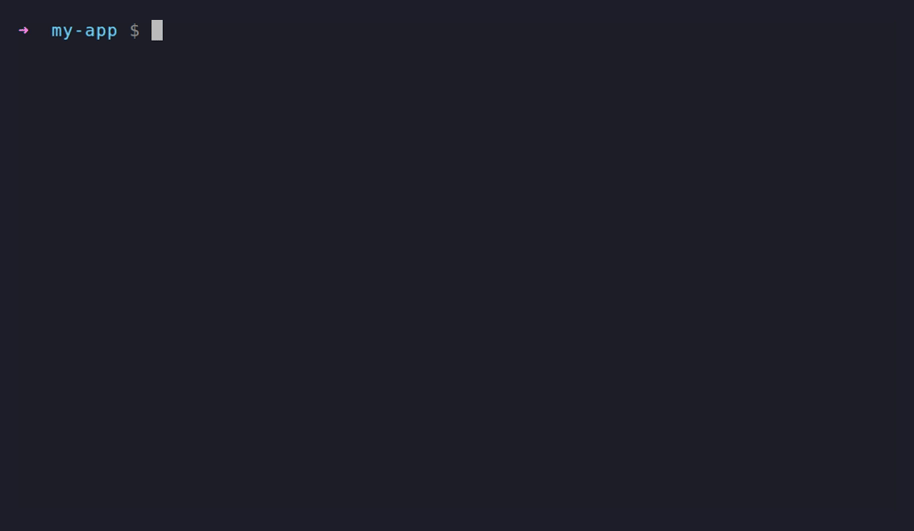

<div align="center">

# claude-init

**One command generates the AI context files for every coding assistant - from one repo scan.**

`CLAUDE.md` · `AGENTS.md` · Cursor · Windsurf · Cline · Copilot · `GEMINI.md` · Aider · Junie · Warp

```bash
npx @horiastanxd/claude-init
```

[](https://www.npmjs.com/package/@horiastanxd/claude-init)
[](https://github.com/horiastanxd/claude-init/actions/workflows/ci.yml)
[](./LICENSE)
[](https://nodejs.org)

</div>

<div align="center">



</div>

---

## Why

Every AI coding tool wants a file describing your project - and they all use a
different name and format. Keeping ten of them in sync by hand is busywork, and the
moment your stack changes they go stale.

`claude-init` scans your repo once - stack, scripts, structure, env vars, conventions,
git - and writes all of them in seconds. **No API key, no network, 100% local.**

```bash
$ npx @horiastanxd/claude-init
✔ Analyzed my-app (TypeScript, Next.js)
  + CLAUDE.md
  + AGENTS.md
  + .cursor/rules/project.mdc
  + .windsurf/rules/project.md
  + .clinerules/project.md
  + .github/copilot-instructions.md
  + GEMINI.md
  + CONVENTIONS.md
  + .junie/guidelines.md
  + WARP.md

Done. 10 file(s) generated.
```

## Supported tools

| Target (`-t`) | File written | Read by |
| --- | --- | --- |
| `claude` | `CLAUDE.md` | Claude Code |
| `agents` | `AGENTS.md` | OpenAI Codex, Jules, Amp, Zed, Devin, RooCode, Factory, +20 agents |
| `cursor` | `.cursor/rules/project.mdc` | Cursor (modern `.mdc` rules) |
| `windsurf` | `.windsurf/rules/project.md` | Windsurf / Codeium |
| `cline` | `.clinerules/project.md` | Cline, Roo Code |
| `copilot` | `.github/copilot-instructions.md` | GitHub Copilot |
| `gemini` | `GEMINI.md` | Gemini CLI |
| `aider` | `CONVENTIONS.md` | Aider |
| `junie` | `.junie/guidelines.md` | JetBrains Junie |
| `warp` | `WARP.md` | Warp terminal |

> [`AGENTS.md`](https://agents.md) is becoming the shared standard - one file read by
> a growing list of agents. `claude-init` generates it alongside each tool's native
> format, so you are covered both ways.

## Usage

```bash
npx @horiastanxd/claude-init                      # generate everything in the current repo
npx @horiastanxd/claude-init ./path/to/repo       # analyze a different directory
npx @horiastanxd/claude-init -t claude,cursor     # only specific tools
npx @horiastanxd/claude-init --overwrite          # refresh files that already exist
npx @horiastanxd/claude-init --dry-run            # print the analysis as JSON, write nothing
npx @horiastanxd/claude-init list                 # show all targets and their paths
```

By default existing files are left untouched - re-run with `--overwrite` to refresh
them after your stack changes.

```
claude-init [generate] [dir]   analyze a repo and write context files (default)
claude-init check [dir]        verify files are up to date (exit 1 on drift)
claude-init list               list supported targets
claude-init mcp                run as an MCP server over stdio

Options:
  -t, --targets <list>   comma-separated target ids, or "all"   (default: all)
  -o, --output <dir>     output directory                        (default: .)
  --overwrite            overwrite existing files
  --dry-run              print the analysis as JSON, write nothing
```

## Keep context files fresh

`claude-init check` regenerates in memory and compares against disk, exiting non-zero
on drift. Wire it into CI or a pre-commit hook so your context never rots.

**pre-commit** (`.git/hooks/pre-commit` or [pre-commit](https://pre-commit.com)):

```bash
npx @horiastanxd/claude-init check || {
  echo "AI context files are stale - run: npx @horiastanxd/claude-init --overwrite"
  exit 1
}
```

**GitHub Actions:**

```yaml
- run: npx @horiastanxd/claude-init check
```

## Example output

<details>
<summary><code>CLAUDE.md</code> generated for a Next.js + Prisma app</summary>

```markdown
# my-app

A demo application.

## Stack
- Language: TypeScript
- Framework: Next.js
- Runtime: Node.js
- Package manager: pnpm
- Database: Prisma ORM
- Testing: Vitest

## Commands
```bash
pnpm install   # install
pnpm run dev   # dev
pnpm run test  # test
```

## Code conventions
- TypeScript strict mode is enabled - keep full type safety, avoid `any`.
- Linter: ESLint. Run it before committing.
- Formatter: Prettier. Do not hand-format against it.

## Environment variables
Copy `.env.example` to `.env` and set:
- `DATABASE_URL` (**required**) - Postgres connection string
```

</details>

## MCP server

`claude-init` also runs as a [Model Context Protocol](https://modelcontextprotocol.io)
server, so an agent can analyze a repo and write the context files itself.

```bash
# Claude Code
claude mcp add claude-init -- npx @horiastanxd/claude-init --mcp
```

Tools exposed: `analyze_project`, `generate_context_files`, `check_context_files`.

## What gets detected

- **Stack** - language, framework, runtime, package manager, database, test runner, build tool
- **Commands** - install / dev / build / test / lint / format, plus other scripts, `Makefile` / `justfile` / `Taskfile` targets, and commands from `.github/workflows`
- **Structure** - a trimmed file tree, entry points, config files
- **Conventions** - strict mode, linter, formatter, import style, commit convention
- **Env vars** - parsed from `.env.example`, with inline comments as descriptions
- **Git** - default branch, remote, top authors, frequently changed files

Languages: JS/TS (npm, pnpm, yarn, bun), Python (pip, uv, poetry), Rust (cargo),
Go (modules), plus partial detection for Java, Ruby, and PHP.

## Use as a library

```ts
import { analyzeProject, generateClaudeMd, buildFiles } from 'claude-init';

const analysis = await analyzeProject(process.cwd());
const md = generateClaudeMd(analysis);

// or render every target in memory
for (const file of buildFiles(analysis)) {
  console.log(file.relPath, file.content.length);
}
```

## Development

```bash
npm install
npm run dev -- --dry-run   # run from source
npm test
npm run build
```

Contributions welcome - adding a new tool is usually a single entry in
[`src/generators/registry.ts`](./src/generators/registry.ts). See
[CONTRIBUTING.md](./CONTRIBUTING.md).

## Roadmap

- More tools (Zed dedicated rules, Continue, Kilo Code, Trae)
- Monorepo-aware generation (per-package context files)
- Optional LLM pass to enrich descriptions (opt-in, off by default)

Ideas and PRs welcome.

## Star History

[](https://star-history.com/#horiastanxd/claude-init&Date)

## License

[MIT](./LICENSE)

